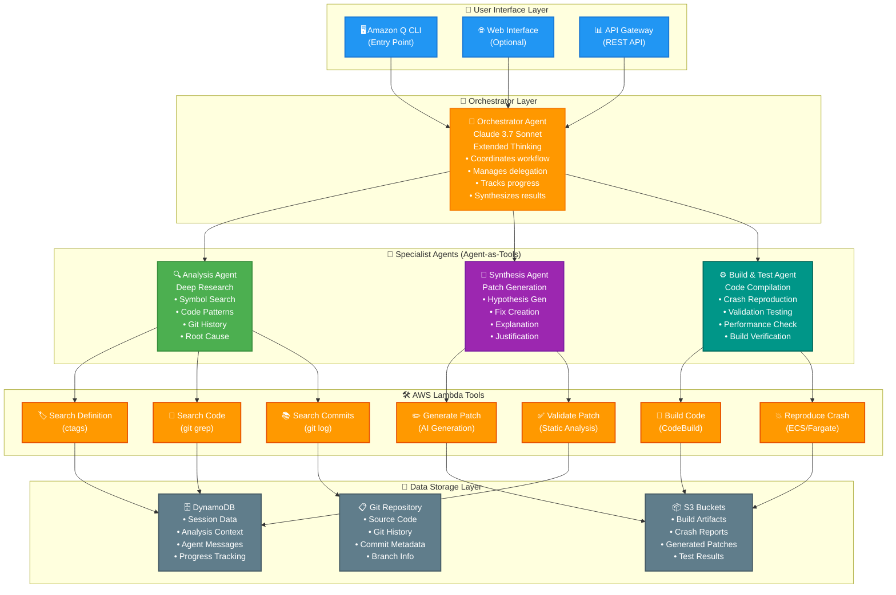
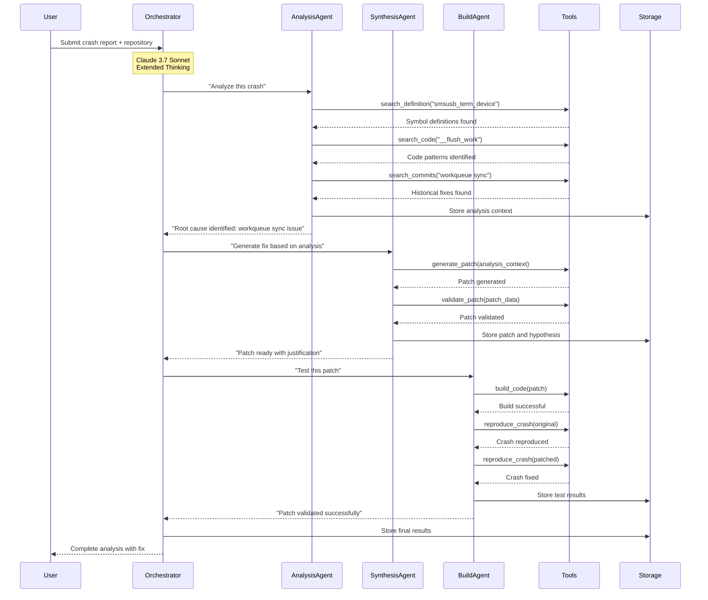
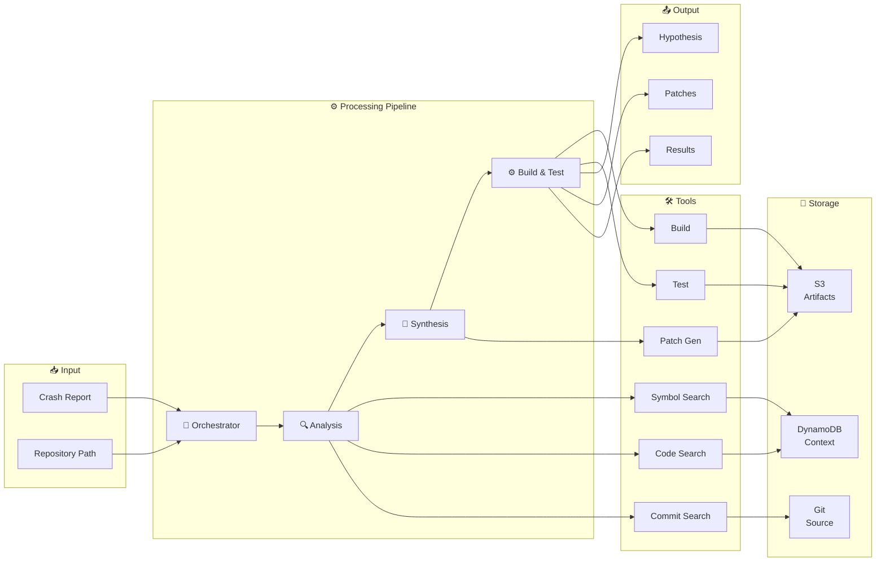
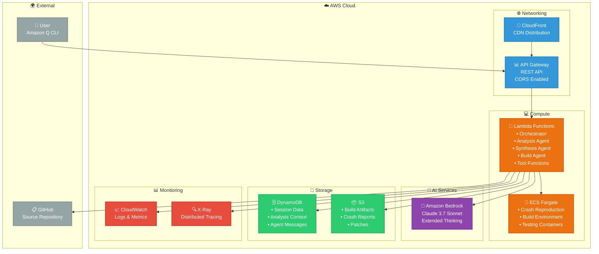

# Code Researcher Agent Orchestration - Mermaid Diagrams

## Main Architecture Diagram

```mermaid
graph TB
    %% User Interface Layer
    subgraph UI["🎯 User Interface Layer"]
        CLI["🖥️ Amazon Q CLI<br/>(Entry Point)"]
        WEB["🌐 Web Interface<br/>(Optional)"]
        API["📊 API Gateway<br/>(REST API)"]
    end
    
    %% Orchestrator Layer
    subgraph ORCH["🧠 Orchestrator Layer"]
        ORCHESTRATOR["🤖 Orchestrator Agent<br/>Claude 3.7 Sonnet<br/>Extended Thinking<br/>• Coordinates workflow<br/>• Manages delegation<br/>• Tracks progress<br/>• Synthesizes results"]
    end
    
    %% Specialist Agents Layer
    subgraph AGENTS["👥 Specialist Agents (Agent-as-Tools)"]
        ANALYSIS["🔍 Analysis Agent<br/>Deep Research<br/>• Symbol Search<br/>• Code Patterns<br/>• Git History<br/>• Root Cause"]
        SYNTHESIS["🔧 Synthesis Agent<br/>Patch Generation<br/>• Hypothesis Gen<br/>• Fix Creation<br/>• Explanation<br/>• Justification"]
        BUILD["⚙️ Build & Test Agent<br/>Code Compilation<br/>• Crash Reproduction<br/>• Validation Testing<br/>• Performance Check<br/>• Build Verification"]
    end
    
    %% Tools Layer
    subgraph TOOLS["🛠️ AWS Lambda Tools"]
        SEARCH_DEF["🏷️ Search Definition<br/>(ctags)"]
        SEARCH_CODE["🔎 Search Code<br/>(git grep)"]
        SEARCH_COMMITS["📚 Search Commits<br/>(git log)"]
        GEN_PATCH["✏️ Generate Patch<br/>(AI Generation)"]
        BUILD_CODE["🔨 Build Code<br/>(CodeBuild)"]
        REPRO_CRASH["💥 Reproduce Crash<br/>(ECS/Fargate)"]
        VALIDATE["✅ Validate Patch<br/>(Static Analysis)"]
    end
    
    %% Storage Layer
    subgraph STORAGE["💾 Data Storage Layer"]
        DYNAMO["🗄️ DynamoDB<br/>• Session Data<br/>• Analysis Context<br/>• Agent Messages<br/>• Progress Tracking"]
        S3["📦 S3 Buckets<br/>• Build Artifacts<br/>• Crash Reports<br/>• Generated Patches<br/>• Test Results"]
        GIT["📋 Git Repository<br/>• Source Code<br/>• Git History<br/>• Commit Metadata<br/>• Branch Info"]
    end
    
    %% Connections
    CLI --> ORCHESTRATOR
    WEB --> ORCHESTRATOR
    API --> ORCHESTRATOR
    
    ORCHESTRATOR --> ANALYSIS
    ORCHESTRATOR --> SYNTHESIS
    ORCHESTRATOR --> BUILD
    
    ANALYSIS --> SEARCH_DEF
    ANALYSIS --> SEARCH_CODE
    ANALYSIS --> SEARCH_COMMITS
    
    SYNTHESIS --> GEN_PATCH
    SYNTHESIS --> VALIDATE
    
    BUILD --> BUILD_CODE
    BUILD --> REPRO_CRASH
    
    SEARCH_DEF --> DYNAMO
    SEARCH_CODE --> DYNAMO
    SEARCH_COMMITS --> GIT
    GEN_PATCH --> S3
    BUILD_CODE --> S3
    REPRO_CRASH --> S3
    VALIDATE --> DYNAMO
    
    %% Styling
    classDef userLayer fill:#2196F3,stroke:#1976D2,stroke-width:2px,color:#fff
    classDef orchLayer fill:#FF9800,stroke:#F57C00,stroke-width:2px,color:#fff
    classDef agentLayer fill:#4CAF50,stroke:#388E3C,stroke-width:2px,color:#fff
    classDef synthLayer fill:#9C27B0,stroke:#7B1FA2,stroke-width:2px,color:#fff
    classDef buildLayer fill:#009688,stroke:#00695C,stroke-width:2px,color:#fff
    classDef toolLayer fill:#FF9900,stroke:#E65100,stroke-width:2px,color:#fff
    classDef storageLayer fill:#607D8B,stroke:#455A64,stroke-width:2px,color:#fff
    
    class CLI,WEB,API userLayer
    class ORCHESTRATOR orchLayer
    class ANALYSIS agentLayer
    class SYNTHESIS synthLayer
    class BUILD buildLayer
    class SEARCH_DEF,SEARCH_CODE,SEARCH_COMMITS,GEN_PATCH,BUILD_CODE,REPRO_CRASH,VALIDATE toolLayer
    class DYNAMO,S3,GIT storageLayer
```

## Agent Conversation Flow

```mermaid
sequenceDiagram
    participant User
    participant Orchestrator
    participant AnalysisAgent
    participant SynthesisAgent
    participant BuildAgent
    participant Tools
    participant Storage
    
    User->>Orchestrator: Submit crash report + repository
    Note over Orchestrator: Claude 3.7 Sonnet<br/>Extended Thinking
    
    Orchestrator->>AnalysisAgent: "Analyze this crash"
    AnalysisAgent->>Tools: search_definition("smsusb_term_device")
    Tools-->>AnalysisAgent: Symbol definitions found
    AnalysisAgent->>Tools: search_code("__flush_work")
    Tools-->>AnalysisAgent: Code patterns identified
    AnalysisAgent->>Tools: search_commits("workqueue sync")
    Tools-->>AnalysisAgent: Historical fixes found
    AnalysisAgent->>Storage: Store analysis context
    AnalysisAgent-->>Orchestrator: "Root cause identified: workqueue sync issue"
    
    Orchestrator->>SynthesisAgent: "Generate fix based on analysis"
    SynthesisAgent->>Tools: generate_patch(analysis_context)
    Tools-->>SynthesisAgent: Patch generated
    SynthesisAgent->>Tools: validate_patch(patch_data)
    Tools-->>SynthesisAgent: Patch validated
    SynthesisAgent->>Storage: Store patch and hypothesis
    SynthesisAgent-->>Orchestrator: "Patch ready with justification"
    
    Orchestrator->>BuildAgent: "Test this patch"
    BuildAgent->>Tools: build_code(patch)
    Tools-->>BuildAgent: Build successful
    BuildAgent->>Tools: reproduce_crash(original)
    Tools-->>BuildAgent: Crash reproduced
    BuildAgent->>Tools: reproduce_crash(patched)
    Tools-->>BuildAgent: Crash fixed
    BuildAgent->>Storage: Store test results
    BuildAgent-->>Orchestrator: "Patch validated successfully"
    
    Orchestrator->>Storage: Store final results
    Orchestrator-->>User: Complete analysis with fix
```

## Data Flow Diagram

```mermaid
flowchart LR
    subgraph INPUT["📥 Input"]
        CR["Crash Report"]
        RP["Repository Path"]
    end
    
    subgraph PROCESSING["⚙️ Processing Pipeline"]
        O["🧠 Orchestrator"]
        A["🔍 Analysis"]
        S["🔧 Synthesis"] 
        B["⚙️ Build & Test"]
    end
    
    subgraph TOOLS["🛠️ Tools"]
        T1["Symbol Search"]
        T2["Code Search"]
        T3["Commit Search"]
        T4["Patch Gen"]
        T5["Build"]
        T6["Test"]
    end
    
    subgraph STORAGE["💾 Storage"]
        DB["DynamoDB<br/>Context"]
        S3B["S3<br/>Artifacts"]
        GIT["Git<br/>Source"]
    end
    
    subgraph OUTPUT["📤 Output"]
        H["Hypothesis"]
        P["Patches"]
        R["Results"]
    end
    
    CR --> O
    RP --> O
    O --> A
    A --> S
    S --> B
    
    A --> T1
    A --> T2
    A --> T3
    S --> T4
    B --> T5
    B --> T6
    
    T1 --> DB
    T2 --> DB
    T3 --> GIT
    T4 --> S3B
    T5 --> S3B
    T6 --> S3B
    
    B --> H
    B --> P
    B --> R
```

## AWS Services Architecture

```mermaid
graph TB
    subgraph AWS["☁️ AWS Cloud"]
        subgraph COMPUTE["💻 Compute"]
            LAMBDA["🔧 Lambda Functions<br/>• Orchestrator<br/>• Analysis Agent<br/>• Synthesis Agent<br/>• Build Agent<br/>• Tool Functions"]
            FARGATE["🐳 ECS Fargate<br/>• Crash Reproduction<br/>• Build Environment<br/>• Testing Containers"]
        end
        
        subgraph AI["🤖 AI Services"]
            BEDROCK["🧠 Amazon Bedrock<br/>Claude 3.7 Sonnet<br/>Extended Thinking"]
        end
        
        subgraph STORAGE["💾 Storage"]
            DDB["🗄️ DynamoDB<br/>• Session Data<br/>• Analysis Context<br/>• Agent Messages"]
            S3["📦 S3<br/>• Build Artifacts<br/>• Crash Reports<br/>• Patches"]
        end
        
        subgraph NETWORK["🌐 Networking"]
            APIGW["📊 API Gateway<br/>REST API<br/>CORS Enabled"]
            CF["🚀 CloudFront<br/>CDN Distribution"]
        end
        
        subgraph MONITOR["📊 Monitoring"]
            CW["📈 CloudWatch<br/>Logs & Metrics"]
            XRAY["🔍 X-Ray<br/>Distributed Tracing"]
        end
    end
    
    subgraph EXTERNAL["🌍 External"]
        USER["👤 User<br/>Amazon Q CLI"]
        GITHUB["📋 GitHub<br/>Source Repository"]
    end
    
    USER --> APIGW
    APIGW --> LAMBDA
    LAMBDA --> BEDROCK
    LAMBDA --> DDB
    LAMBDA --> S3
    LAMBDA --> FARGATE
    LAMBDA --> GITHUB
    
    CF --> APIGW
    LAMBDA --> CW
    LAMBDA --> XRAY
    
    classDef aws fill:#FF9900,stroke:#E65100,stroke-width:2px,color:#fff
    classDef compute fill:#EC7211,stroke:#D35400,stroke-width:2px,color:#fff
    classDef ai fill:#8E44AD,stroke:#7D3C98,stroke-width:2px,color:#fff
    classDef storage fill:#2ECC71,stroke:#27AE60,stroke-width:2px,color:#fff
    classDef network fill:#3498DB,stroke:#2980B9,stroke-width:2px,color:#fff
    classDef monitor fill:#E74C3C,stroke:#C0392B,stroke-width:2px,color:#fff
    classDef external fill:#95A5A6,stroke:#7F8C8D,stroke-width:2px,color:#fff
    
    class LAMBDA,FARGATE compute
    class BEDROCK ai
    class DDB,S3 storage
    class APIGW,CF network
    class CW,XRAY monitor
    class USER,GITHUB external
```
